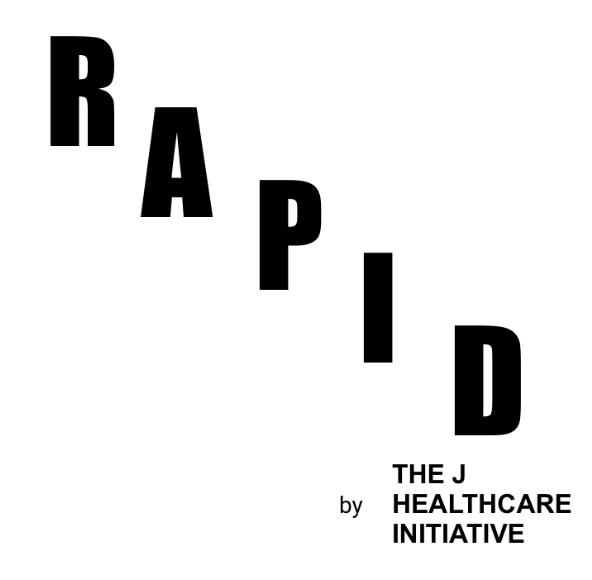
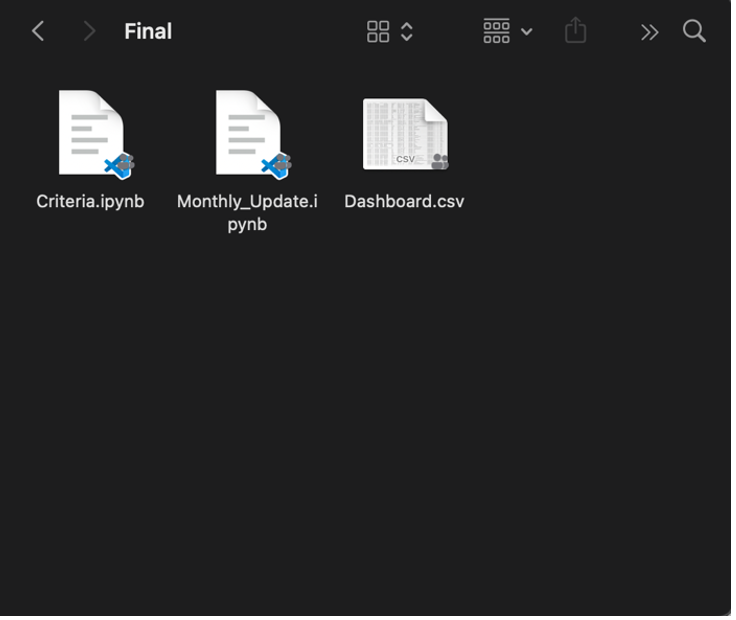
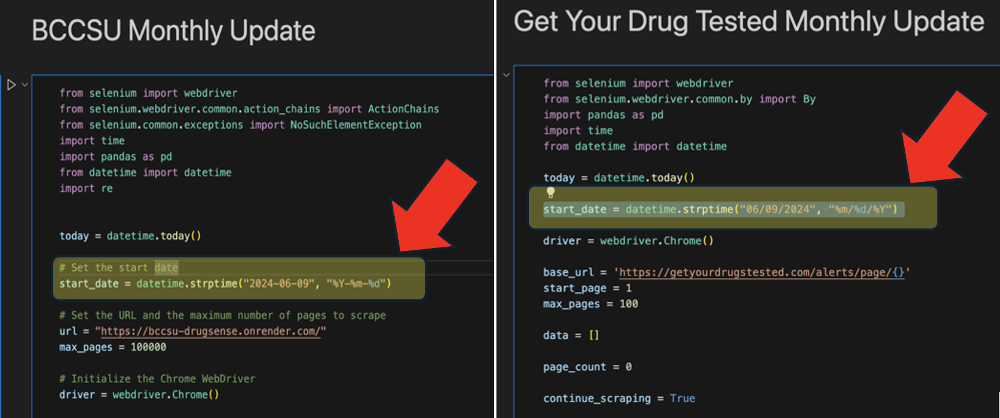
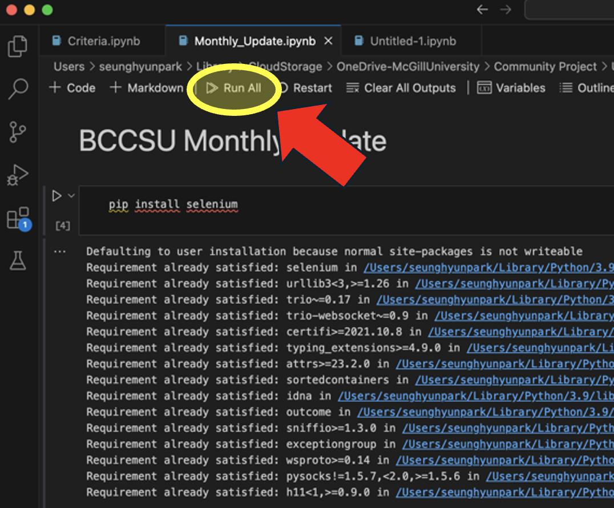

# RAPID: Real-time Alert Platform for Informed Decisions


## Table of Contents
1. Introduction
2. Features
3. Installation
4. Prerequisites
5. Usage

## Introduction

This project focuses on collecting data from various online sources, applying specific criteria to identify harmful drug adulterants, and building an alert system through a dashboard named RAPID (Real-time Alert Platform for Informed Decisions). RAPID implements clear criteria to identify and alert about illicit drug batches, significantly improving public health outcomes. This data-driven approach enhances healthcare system preparedness, enables more effective resource allocation, and facilitates evidence-based policy development. It also lays the foundation for robust research by offering insights into illicit drug trends.

## Installation

Step-by-step instructions on how to install and set up the project:

1. Clone the repository:
   ```bash
   git clone https://github.com/yourusername/RAPID.git
   cd RAPID
   ```
2. Create a virtual environment and activate it:
   ```bash
   python -m venv venv
   source venv/bin/activate  # On Windows, use `venv\Scripts\activate`
   ```
3. Install the required dependencies:
   ```
   pip install -r requirements.txt
   ```
   
### Prerequisites

List of prerequisites necessary for the project:

	•	Python 3.x
 	•	Jupyter Notebook
	•	Pandas
	•	Numpy
	•	Selenium

Ensure you have the required datasets:

	•	Dashboard.csv

## Usage

1.	Ensure you have the necessary dataset (Dashboard.csv) in the project directory.

   	
    
2.	Open the Jupyter notebook file (Monthly_Update.ipynb) and set the initial dates.

   	
    
3.	Run the code to gather, process the data.

   	
    
4. 	Add external data on Monthly_Update.csv file if there is any.
   
5.	Open the Jupyter notebook file (Criteria.ipynb) and Run to apply criteria.
    
6.	The processed data (Dashboard.csv) will have alert status based on the criteria.
 

## Example


## Features

List of key features included in the project:

	•	Real-time data processing and alert generation
	•	Criteria-based filtering for different drug categories
	•	Integration with Google Looker Studio for interactive dashboards
	•	Automated ETL process for updating data and dashboards## View the Dashboard
 
You can view the interactive dashboard [here](https://lookerstudio.google.com/embed/reporting/d4ee0e89-a8b2-4d92-9926-f69474198d63/page/p_lffrf20bjd).

## Data Sources

Details about the data sources used in the project:

- [British Columbia Centre on Substance Use & UBC MDS Drugsense](https://bccsu-drugsense.onrender.com)
- [Get Your Drugs Tested](https://getyourdrugstested.com/alerts/)


Contact Information
For any questions or concerns, please contact:
Name: Seunghyun Park
Email: seunghyun.park@mail.mcgill.ca
GitHub: https://github.com/SeunghyunParkk
